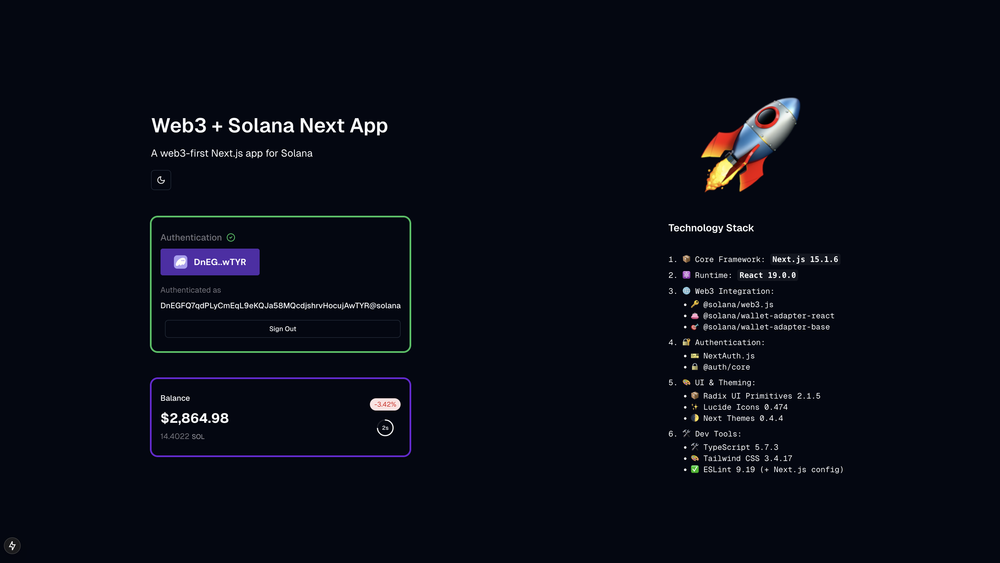

# Next.js Web3 Starter Template

A modern web3-first Next.js 15 application template with built-in Solana blockchain integration.

## 🚀 Technology Stack

### Core Framework

- [Next.js 15](https://nextjs.org) - React framework with App Router
- React 19 - UI library
- TypeScript - Type safety
- TurboRepo - Monorepo and build optimization

### Authentication

- NextAuth.js - Authentication solution
- Web3Auth - Blockchain wallet authentication
- Custom credential provider

### Web3/Blockchain

- Solana Web3.js - Solana blockchain integration
- Multiple wallet support
- Network switching support

### UI/UX

- Tailwind CSS - Utility-first styling
- Shadcn UI - React component library
- Geist Font - Modern typography
- Dark/Light mode support

### Development Tools

- ESLint - Linting
- Prettier - Code formatting
- pnpm - Package manager
- Turborepo - Build system optimization

## 🛠️ Getting Started

1. Clone the repository:

```bash
git clone <repository-url>
```

2. Install dependencies:

```bash
pnpm install
```

3. Run the development server:

```bash
pnpm dev
```

Open [http://localhost:3000](http://localhost:3000) with your browser to see the result.

You can start editing the page by modifying `app/page.tsx`. The page auto-updates as you edit the file.

This project uses [`next/font`](https://nextjs.org/docs/app/building-your-application/optimizing/fonts) to automatically optimize and load [Geist](https://vercel.com/font), a new font family for Vercel.

## Screenshots



## Learn More

To learn more about Next.js, take a look at the following resources:

- [Next.js Documentation](https://nextjs.org/docs) - learn about Next.js features and API.
- [Learn Next.js](https://nextjs.org/learn) - an interactive Next.js tutorial.

You can check out [the Next.js GitHub repository](https://github.com/vercel/next.js) - your feedback and contributions are welcome!

## Deploy on Vercel

The easiest way to deploy your Next.js app is to use the [Vercel Platform](https://vercel.com/new?utm_medium=default-template&filter=next.js&utm_source=create-next-app&utm_campaign=create-next-app-readme) from the creators of Next.js.

Check out our [Next.js deployment documentation](https://nextjs.org/docs/app/building-your-application/deploying) for more details.
